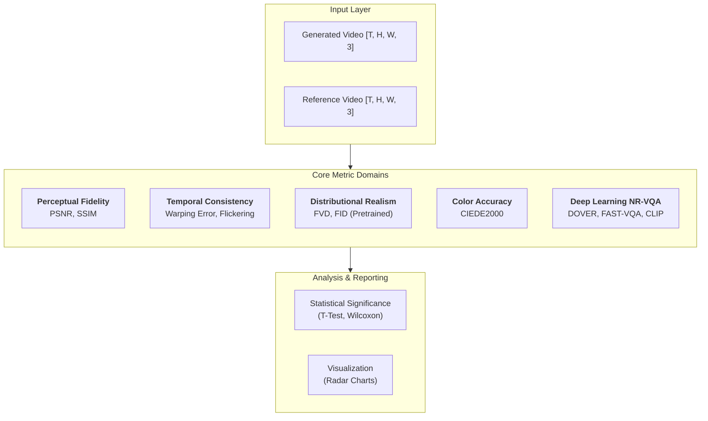

# ComfyUI Video Quality Metrics: Comprehensive Technical Reference

This document provides an exhaustive breakdown of every metric implemented in this library, covering their mathematical foundations, algorithmic logic, interpretation guidelines, and specific implications for Generative AI (AIGC).

---

## 📂 Evaluation Strategies: With vs. Without Reference

A common challenge in Generative AI (Diffusion models) is the lack of a "ground truth" reference video. This library supports three distinct evaluation modes:

### Scenario A: Video-to-Video / Upscaling (Full-Reference)
*   **Workflow**: You have an input video and an AI-processed output.
*   **Metrics**: Use **all metrics** (PSNR, SSIM, ΔE00, Warping Error, FVD).
*   **Goal**: Ensure the AI preserved the structure and color of the source while adding detail.

### Scenario B: Text-to-Video (No-Reference / Internal)
*   **Workflow**: You have a single generated video from a text prompt.
*   **Metrics**: Use **Temporal Consistency** (`VQ_TemporalConsistency`, `VQ_MotionSmoothness`) and **Deep Learning NR-VQA** (`VQ_DOVERQuality`, `VQ_FASTVQAScore`).
*   **Goal**: These nodes analyze the video *internally*. They detect flickering, jitter, artifacts, and aesthetic issues without needing a reference.

### Scenario C: Comparative Benchmarking (Workflow A vs. B)
*   **Workflow**: You have two different models/prompts and want to know which is better.
*   **Metrics**: Use **Distributional Metrics** (FVD, FID) and **Fidelity Metrics** (using one workflow as the "baseline").
*   **Goal**: Use `VQ_MetricsComparison` to see which workflow is statistically more realistic or stable.

---

## 🏗️ System Architecture

The library is structured into modular components:
- **`core/`**: Pure PyTorch implementations of the math and feature extraction.
- **`nodes/`**: ComfyUI-specific wrapper classes.
- **`models/`**: Pre-trained weights management and auto-downloaders.
- **`utils/`**: Shared plotting, statistics, logging, and tensor manipulation logic.

---

## 1. Perceptual & Signal Fidelity (Full-Reference)
These metrics require a "ground truth" reference video to compare against. They are ideal for evaluating **Upscalers**, **Video-to-Video** models, and **Motion Transfer** workflows.

### 1.1 Peak Signal-to-Noise Ratio (PSNR)
PSNR measures the ratio between the maximum possible power of a signal and the power of corrupting noise.
- **Calculation**: Derived from Mean Squared Error (MSE).
  $$MSE = \frac{1}{mn}\sum_{i=0}^{m-1}\sum_{j=0}^{n-1}[I(i,j) - K(i,j)]^2$$
  $$PSNR = 20 \cdot \log_{10}(MAX_I / \sqrt{MSE})$$
- **In this Library**: Implemented in `core/fidelity.py`. It handles batches by averaging MSE across all frames/images.
- **Interpretation**:
  - **> 40 dB**: Excellent (almost identical to human eye).
  - **30 - 40 dB**: Good (minor perceptible artifacts).
  - **< 20 dB**: Poor (significant degradation).
- **AIGC Context**: PSNR is very sensitive to pixel shifts. If your AI video is shifted by just 1 pixel, PSNR will tank even if the video looks perfect. Use it to detect noise and compression, not artistic quality.

### 1.2 Structural Similarity Index (SSIM)
SSIM is designed to align with the Human Visual System (HVS), which is sensitive to structure rather than pixel values.
- **Calculation**: Compares luminance ($l$), contrast ($c$), and structure ($s$).
  $$SSIM(x,y) = [l(x,y)]^\alpha \cdot [c(x,y)]^\beta \cdot [s(x,y)]^\gamma$$
- **In this Library**: Uses a Gaussian-weighted sliding window to compute local SSIM maps, which are then averaged. Non-standard input shapes are automatically handled via `tensor_to_hchw`.
- **Interpretation**: Range is [0, 1].
  - **> 0.95**: High structural preservation.
  - **< 0.80**: Noticeable structural warping or blurring.
- **AIGC Context**: Excellent for checking if an Image-to-Video model is "hallucinating" new backgrounds or changing the character's face structure too much.

---

## 2. Temporal Consistency (Motion Domain)
Temporal coherence is the hallmark of professional AI video. These metrics detect the "flicker" and "jitter" common in diffusion-based models.

### 2.1 Warping Error (Optical Flow Consistency)
Measures how consistently pixels move between frames.
- **Algorithm**:
  1. Calculate **Optical Flow** ($F_{t \to t+1}$) using **RAFT** (high accuracy) or **Lucas-Kanade** (fast fallback).
  2. Use the flow to **warp** frame $t+1$ back to the position of frame $t$.
  3. Calculate the difference (Residual) between the original frame $t$ and the warped version.
- **Occlusion Handling**: We compute bidirectional flow. If a pixel's movement doesn't match when calculated forward vs backward (Flow Consistency Check), we mask it out as an "occlusion" to avoid false positives.
- **Interpretation**: Lower is better. A sudden spike in warping error indicates a "jump" or "glitch" in the motion.

### 2.2 Temporal Flickering
Detects unstable lighting or intensity fluctuations.
- **Logic**: Analyzes the rolling standard deviation of the global mean brightness over a temporal window (default $T=5$).
- **Interpretation**: Range [0, 1].
  - **Low (< 0.1)**: Stable lighting.
  - **High (> 0.3)**: Distracting flickering (typical of early Video-SVD models without temporal attention).

### 2.3 Motion Smoothness (Jerk Analysis)
Measures the physical plausibility of motion trajectories.
- **Calculation**: Calculates the **Jerk** (the 2nd derivative of velocity/flow).
  $$Jerk = \frac{d^3s}{dt^3}$$
- **Interpretation**: 
  - **High Smoothness (> 0.8)**: Cinematic, steady motion.
  - **Low Smoothness (< 0.4)**: Robotic or jittery movement (high-frequency motion noise).

---

## 3. Distributional Realism (Reference-Free / Semantic)
These metrics answer the question: "Does this video *look* like a real video from the real world?"

### 3.1 Fréchet Video Distance (FVD)
The industry standard for evaluating video realism.
- **Mechanism**:
  1. Encodes videos into 512-dimensional features using an **R3D-18 (3D ResNet)** pretrained on the Kinetics-400 dataset.
  2. Measures the **Fréchet Distance** (Wasserstein-2) between the feature distributions of the generated set and a reference set.
- **Interpretation**: Lower is better. 0 means the distributions are identical.
- **Note**: Requires at least 2 videos in a batch to calculate covariance. For single videos, it provides a limited estimate.

### 3.2 Fréchet Inception Distance (FID)
Evaluates the aesthetic quality of individual frames.
- **Mechanism**: Uses **Inception V3** pretrained on ImageNet to extract 2048-dimensional features.
- **Use Case**: Detecting whether frames are "blurry" or "fake-looking" even if the motion is smooth.

### 3.3 Video Frame-by-Frame FID (VideoFID)
A hybrid metric for video-to-video comparison.
- **Logic**: Calculates the FID between the generated video's frames and the reference video's frames.
- **Why it matters**: Unlike global FID (which pools all frames), this measures how well the AI reproduces the *specific* aesthetics of each frame in order.
- **Output**: Mean FID and per-frame distance range.

---

## 4. Deep Learning No-Reference Metrics (SOTA)
These advanced metrics use neural networks trained on human subjective ratings (Mean Opinion Scores) to judge quality without needing a reference video. They are the **gold standard** for evaluating Text-to-Video models.

### 4.1 CLIP-IQA (Aesthetic & Alignment)
Leverages OpenAI's CLIP model (ViT-B/32) to measure visual appeal and prompt adherence.
- **Aesthetic Score**: measures the "artistic beauty" of frames.
- **Text-Video Alignment**: Measures how well the video matches the text prompt.
- **Temporal Drift**: Detects if the video typically "forgets" the prompt over time (e.g., a cat turning into a dog).

### 4.2 DOVER (Disentangled Objective Video Quality Evaluator)
A state-of-the-art method that separates quality into two distinct axes:
1.  **Aesthetic Score**: Composition, color harmony, lighting, and "artistic vibe".
2.  **Technical Score**: Sharpness, noise, compression artifacts, and exposure issues.
-   **Architecture**: Uses a **Swin Transformer (Tiny)** backbone.
-   **Why use it**: Tells you *why* a video is bad (e.g., "Good composition but too blurry").

### 4.3 FAST-VQA (Fragment Attention Network)
Designed for efficiency and high-resolution video assessment.
-   **Mechanism**: Uses **Grid Mini-patch Sampling (GMS)**. Instead of resizing a 4K video to 224x224 (destroying detail), it samples small 32x32 patches at full resolution.
-   **Architecture**: Fragment Attention Network (FANet).
-   **Use Case**: Best for detecting fine-grained artifacts like noise or upscaling glitches.

---

## 4. Reporting & Workflow Analysis

### 4.1 Metrics Logger (JSON)
Designed for automation and experiment tracking.
- **Output**: A structured JSON string capturing every metric value.
- **Use Case**: Save these outputs to a text file using ComfyUI's standard Save nodes to build a long-term benchmark database of your various workflows.

### 4.2 Workflow Comparison & Statistical Power
Compares two workflows (A and B) and highlights the "Winner" for each metric.
- **Statistical Significance**: Uses the P-value to tell you if a +2dB improvement in PSNR is actually meaningful or just random chance.
- **Rule of Thumb**: Only trust an improvement if the P-value is **below 0.05**.

---

## 5. Color & Perceptual Stability

### 5.1 CIEDE2000 ($\Delta E_{00}$)
The most advanced metric for delta-color difference.
- **Logic**: Converts RGB to **CIELAB** space, which is designed to be perceptually linear. It applies specialized weights to compensate for the HVS sensitivity to different hues (like blue vs red).
- **Interpretation**:
  - **< 1.0**: Imperceptible change.
  - **2.3**: "Noticeable difference" threshold.
  - **> 5.0**: Significant color drift (e.g., skin tones shifting to green).

---

## 6. Statistical Tools
How to tell if **Workflow A** is definitively better than **Workflow B**.

### 6.1 T-Test (Independent/Dependent)
- **Use Case**: Comparing average scores across two different experiments.
- **P-Value**: If $P < 0.05$, there is a 95% probability that the difference between your workflows is real and not just a lucky seed.

### 6.2 Wilcoxon Signed-Rank Test
- **Use Case**: Used for paired comparisons (e.g., comparing Workflow A and B on the same 50 prompts). It is more robust than the T-test if your data has "outliers" (one extremely bad video that ruins the average).

---

## 📊 Evaluation Strategy: The Radar Chart
Because no single metric is perfect, we recommend using the **Radar Chart Node**.
- **Spade Shape**: Good for upscaling (High PSNR, High SSIM, Low warping).
- **Circle Shape**: Good for creative generation (Low FVD, High Smoothness, ignoring PSNR).

For a complete analysis, connect all metric outputs to the `VQ_RadarChart` node to visualize your model's "Performance Fingerprint."

---

## 📋 Complete Node Reference

This section documents every node in detail, including inputs, outputs, and comprehensive interpretation guidelines.

---

### `VQ_FullReferenceMetrics` — PSNR, SSIM, CIEDE2000

**Category**: `VideoQuality`  
**Type**: Full-Reference (requires ground truth)

| Input | Type | Description |
|:---|:---|:---|
| `images` | IMAGE | Generated/processed frames |
| `reference` | IMAGE | Ground truth frames |

| Output | Type | Description |
|:---|:---|:---|
| `psnr` | FLOAT | Peak Signal-to-Noise Ratio (dB) |
| `ssim` | FLOAT | Structural Similarity Index [0-1] |
| `ciede2000` | FLOAT | Perceptual color difference |
| `summary` | STRING | Human-readable report |

#### Interpretation Guidelines

##### PSNR (Peak Signal-to-Noise Ratio)
Measures pixel-level reconstruction accuracy. Higher is better.

| Value | Quality | Description |
|:---|:---|:---|
| **> 45 dB** | Excellent | Almost indistinguishable from original |
| **40-45 dB** | Very Good | Professional broadcast quality |
| **35-40 dB** | Good | High-quality streaming (Netflix) |
| **30-35 dB** | Acceptable | Standard web video |
| **25-30 dB** | Fair | Visible compression artifacts |
| **< 25 dB** | Poor | Significant degradation |

> [!WARNING]
> PSNR is extremely sensitive to spatial shifts. A 1-pixel misalignment can drop PSNR by 10+ dB even if the video looks identical. Use SSIM for perceptual quality.

##### SSIM (Structural Similarity Index)
Measures structural preservation aligned with human perception. Range: [0, 1]. Higher is better.

| Value | Quality | Description |
|:---|:---|:---|
| **> 0.97** | Excellent | Minimal degradation, visually identical |
| **0.95-0.97** | Very Good | Slight differences, professional quality |
| **0.90-0.95** | Good | Minor structural changes visible |
| **0.85-0.90** | Fair | Noticeable blurring or warping |
| **0.80-0.85** | Acceptable | Visible distortions |
| **< 0.80** | Poor | Severe structural corruption |

##### CIEDE2000 (ΔE00)
Measures perceptual color difference in CIELAB space. Lower is better.

| Value | Perception | Description |
|:---|:---|:---|
| **< 1.0** | Imperceptible | No visible color difference |
| **1.0-2.0** | Barely Perceptible | Only visible under close inspection |
| **2.0-3.5** | Noticeable | Clear color shift to trained eye |
| **3.5-5.0** | Significant | Obvious color difference to anyone |
| **> 5.0** | Severe | Major color corruption (skin turns green) |

---

### `VQ_TemporalConsistency` — Warping Error & Flickering

**Category**: `VideoQuality/Temporal`  
**Type**: No-Reference (internal analysis)

| Input | Type | Description |
|:---|:---|:---|
| `video_frames` | IMAGE | Video tensor [T, H, W, C] |
| `bidirectional_flow` | BOOLEAN | Use forward+backward flow (more accurate) |

| Output | Type | Description |
|:---|:---|:---|
| `warping_error` | FLOAT | Motion inconsistency score [0-∞] |
| `flickering_score` | FLOAT | Brightness instability [0-1] |
| `summary` | STRING | Human-readable report |

#### Interpretation Guidelines

##### Warping Error
Measures how consistently pixels move between frames. Lower is better.

| Value | Quality | Description |
|:---|:---|:---|
| **< 0.02** | Excellent | Perfectly smooth motion |
| **0.02-0.05** | Very Good | Minor temporal noise |
| **0.05-0.10** | Good | Slight jitter in fine details |
| **0.10-0.20** | Fair | Noticeable warping artifacts |
| **0.20-0.50** | Poor | Objects "swimming" or morphing |
| **> 0.50** | Severe | Major temporal discontinuities |

> [!TIP]
> A sudden spike in warping error at a specific frame indicates a "glitch" or "jump" in the motion. Use per-frame analysis to locate the exact problem frame.

##### Flickering Score
Measures brightness instability over time. Lower is better.

| Value | Quality | Description |
|:---|:---|:---|
| **< 0.05** | Excellent | Perfectly stable lighting |
| **0.05-0.10** | Very Good | Imperceptible variation |
| **0.10-0.20** | Good | Slight luminance drift |
| **0.20-0.30** | Fair | Noticeable flicker |
| **> 0.30** | Poor | Distracting strobe effect |

---

### `VQ_MotionSmoothness` — Jerk Analysis

**Category**: `VideoQuality/Temporal`  
**Type**: No-Reference (internal analysis)

| Input | Type | Description |
|:---|:---|:---|
| `video_frames` | IMAGE | Video tensor [T, H, W, C] |

| Output | Type | Description |
|:---|:---|:---|
| `smoothness_score` | FLOAT | Motion fluidity [0-1] |
| `mean_jerk` | FLOAT | Average acceleration change |
| `summary` | STRING | Human-readable report |

#### Interpretation Guidelines

##### Smoothness Score
Derived from jerk (3rd derivative of position). Higher is better.

| Value | Quality | Description |
|:---|:---|:---|
| **> 0.85** | Excellent | Cinematic, buttery smooth |
| **0.70-0.85** | Very Good | Professional quality |
| **0.55-0.70** | Good | Slight jitter in fast motion |
| **0.40-0.55** | Fair | Noticeable robotic movement |
| **0.25-0.40** | Poor | Jerky, unnatural motion |
| **< 0.25** | Severe | Extreme jitter (frame interpolation failures) |

##### Mean Jerk
Raw acceleration change metric. Lower is better (closer to 0 = smoother).

| Value | Quality | Description |
|:---|:---|:---|
| **< 0.1** | Excellent | Human-annotated quality smoothness |
| **0.1-0.3** | Good | Natural motion |
| **0.3-0.7** | Fair | Some abrupt changes |
| **> 0.7** | Poor | Robotic or erratic |

---

### `VQ_FVD` — Fréchet Video Distance

**Category**: `VideoQuality/Distributional`  
**Type**: Reference-Based (distribution comparison)

| Input | Type | Description |
|:---|:---|:---|
| `video_generated` | IMAGE | Generated video batch |
| `video_reference` | IMAGE | Reference video batch |

| Output | Type | Description |
|:---|:---|:---|
| `fvd` | FLOAT | Distributional distance |
| `summary` | STRING | Human-readable report |

#### Interpretation Guidelines

FVD measures how "realistic" generated videos are compared to real videos. Lower is better.

| Value | Quality | Description |
|:---|:---|:---|
| **< 50** | Excellent | State-of-the-art quality |
| **50-100** | Very Good | High-quality generation |
| **100-150** | Good | Minor distributional gaps |
| **150-250** | Fair | Noticeable realism issues |
| **250-400** | Poor | Significant quality gap |
| **> 400** | Severe | Unrealistic outputs |

> [!IMPORTANT]
> FVD differences of ~50 points are generally distinguishable by human observers. Use FVD for model comparison, not absolute quality assessment.

> [!WARNING]
> FVD can be biased toward per-frame quality over temporal coherence. A video with temporal glitches may score better than one with slight blur.

---

### `VQ_FID` — Fréchet Inception Distance

**Category**: `VideoQuality/Distributional`  
**Type**: Reference-Based (frame distribution)

| Input | Type | Description |
|:---|:---|:---|
| `images_generated` | IMAGE | Generated images/frames |
| `images_reference` | IMAGE | Reference images/frames |

| Output | Type | Description |
|:---|:---|:---|
| `fid` | FLOAT | Distributional distance |
| `summary` | STRING | Human-readable report |

#### Interpretation Guidelines

FID measures the realism and diversity of generated images. Lower is better.

| Value | Quality | Description |
|:---|:---|:---|
| **< 10** | Excellent | Near-photorealistic |
| **10-30** | Very Good | High-quality generation |
| **30-50** | Good | Competitive with baselines |
| **50-100** | Fair | Noticeable quality gap |
| **100-200** | Poor | Significant realism issues |
| **> 200** | Severe | Clearly artificial |

> [!NOTE]
> FID is most meaningful in comparative contexts. Use it to track training progress or compare model architectures, not as an absolute quality measure.

---

### `VQ_CLIPAestheticScore` — Frame Aesthetic Quality

**Category**: `VideoQuality/CLIP`  
**Type**: No-Reference (learned aesthetic)

| Input | Type | Description |
|:---|:---|:---|
| `images` | IMAGE | Frames to evaluate |

| Output | Type | Description |
|:---|:---|:---|
| `aesthetic_score` | FLOAT | Visual appeal [0-1] |
| `summary` | STRING | Human-readable report |

#### Interpretation Guidelines

Based on CLIP's learned understanding of visual aesthetics (trained on AVA dataset patterns).

| Value | Quality | Description |
|:---|:---|:---|
| **> 0.75** | Excellent | Highly aesthetic, artistic quality |
| **0.60-0.75** | Very Good | Visually pleasing composition |
| **0.50-0.60** | Good | Average aesthetic appeal |
| **0.40-0.50** | Fair | Below-average visual quality |
| **0.25-0.40** | Poor | Unpleasing composition/colors |
| **< 0.25** | Severe | Very low aesthetic value |

---

### `VQ_TextVideoAlignment` — Prompt Adherence

**Category**: `VideoQuality/CLIP`  
**Type**: No-Reference (semantic alignment)

| Input | Type | Description |
|:---|:---|:---|
| `video` | IMAGE | Video frames |
| `prompt` | STRING | Text description |
| `sample_frames` | INT | Frames to sample (default: 8) |

| Output | Type | Description |
|:---|:---|:---|
| `alignment_score` | FLOAT | Prompt match [0-1] |
| `summary` | STRING | Human-readable report with drift detection |

#### Interpretation Guidelines

Measures semantic alignment between video content and text prompt.

| Value | Quality | Description |
|:---|:---|:---|
| **> 0.75** | Excellent | Strong prompt adherence |
| **0.60-0.75** | Very Good | Good semantic match |
| **0.50-0.60** | Good | Moderate alignment |
| **0.40-0.50** | Fair | Partial match, some drift |
| **0.25-0.40** | Poor | Weak correlation |
| **< 0.25** | Severe | Video unrelated to prompt |

> [!TIP]
> Check the "Temporal Drift" value in the summary. A negative drift (e.g., -0.15) indicates the video "forgets" the prompt over time — a common issue with long text-to-video generations.

---

### `VQ_DOVERQuality` — Disentangled Quality Assessment

**Category**: `VideoQuality/DOVER`  
**Type**: No-Reference (deep learning VQA)  
**Weights**: Auto-downloaded from [VQAssessment/DOVER](https://github.com/QualityAssessment/DOVER) (~100MB)

| Input | Type | Description |
|:---|:---|:---|
| `video` | IMAGE | Video tensor |
| `num_frames` | INT | Frames to sample (default: 8) |

| Output | Type | Description |
|:---|:---|:---|
| `aesthetic_score` | FLOAT | Composition/artistic quality [0-1] |
| `technical_score` | FLOAT | Sharpness/noise/artifacts [0-1] |
| `overall_score` | FLOAT | Weighted combination [0-1] |
| `summary` | STRING | Report with imbalance detection |

#### Interpretation Guidelines

DOVER provides MOS-correlated scores (Pearson >0.85 on benchmark datasets).

##### Aesthetic Score (Composition, Color, Lighting)
| Value | Quality | Description |
|:---|:---|:---|
| **> 0.70** | Excellent | Professional cinematography |
| **0.55-0.70** | Very Good | Pleasing composition |
| **0.40-0.55** | Good | Acceptable aesthetics |
| **0.25-0.40** | Fair | Uninteresting framing |
| **< 0.25** | Poor | Poor visual design |

##### Technical Score (Sharpness, Noise, Exposure)
| Value | Quality | Description |
|:---|:---|:---|
| **> 0.70** | Excellent | Broadcast quality |
| **0.55-0.70** | Very Good | Sharp, clean output |
| **0.40-0.55** | Good | Minor artifacts |
| **0.25-0.40** | Fair | Noticeable blur/noise |
| **< 0.25** | Poor | Severe degradation |

##### Overall Score (0.428 × Aesthetic + 0.572 × Technical)
| Value | Quality | Description |
|:---|:---|:---|
| **> 0.65** | Excellent | Top-tier quality |
| **0.50-0.65** | Very Good | High quality |
| **0.35-0.50** | Good | Acceptable |
| **0.20-0.35** | Fair | Below average |
| **< 0.20** | Poor | Low quality |

> [!IMPORTANT]
> **Imbalance Detection**: If `|aesthetic - technical| > 0.2`, the video has a quality imbalance. Example: "Aesthetic > Technical" means good composition but blurry/noisy. "Technical > Aesthetic" means sharp but boring.

---

### `VQ_FASTVQAScore` — Efficient High-Resolution VQA

**Category**: `VideoQuality/FAST-VQA`  
**Type**: No-Reference (deep learning VQA)  
**Weights**: Auto-downloaded from [VQAssessment/FAST-VQA](https://github.com/VQAssessment/FAST-VQA-and-FasterVQA) (~200MB)

| Input | Type | Description |
|:---|:---|:---|
| `video` | IMAGE | Video tensor |

| Output | Type | Description |
|:---|:---|:---|
| `quality_score` | FLOAT | Overall quality [0-1] |
| `summary` | STRING | Human-readable report |

#### Interpretation Guidelines

FAST-VQA uses Grid Mini-patch Sampling (GMS) to preserve high-resolution details.

| Value | Quality | Description |
|:---|:---|:---|
| **> 0.75** | Excellent | Extremely good quality |
| **0.60-0.75** | Very Good | Good quality |
| **0.50-0.60** | Good | Fair quality |
| **0.35-0.50** | Fair | Below average |
| **0.25-0.35** | Poor | Bad quality |
| **< 0.25** | Severe | Extremely bad quality |

> [!TIP]
> FAST-VQA is particularly effective at detecting fine-grained artifacts like upscaling halos, compression blocking, and noise patterns that global metrics miss.

---

### `VQ_RadarChart` — Multi-Metric Visualization

**Category**: `VideoQuality/Reporting`

Creates a radar chart showing normalized scores across all metrics for quick visual comparison.

| Input | Type | Description |
|:---|:---|:---|
| `psnr, ssim, ...` | FLOAT | Various metric values |
| `chart_size` | INT | Output image size |

| Output | Type | Description |
|:---|:---|:---|
| `radar_chart` | IMAGE | Visualization tensor |
| `metrics_json` | STRING | Raw + normalized values |

**Shape Interpretation**:
- **Circle**: Balanced quality across all dimensions
- **Spade**: Optimized for full-reference fidelity (upscaling)
- **Star**: Strong temporal but weak fidelity (creative generation)

---

### `VQ_MetricsLogger` — JSON Export

**Category**: `VideoQuality/Reporting`

Exports all metrics to structured JSON for experiment tracking and automation.

---

### `VQ_MetricsComparison` — Statistical Comparison

**Category**: `VideoQuality/Reporting`

Compares two workflow JSON outputs with statistical significance testing.

**P-Value Interpretation**:
- **P < 0.01**: Highly significant difference
- **P < 0.05**: Significant difference (trustworthy)
- **P < 0.10**: Marginally significant
- **P ≥ 0.10**: Not significant (could be random)

---

## 📊 Quick Reference: Optimal Values

| Metric | Excellent | Good | Fair | Poor |
|:---|:---|:---|:---|:---|
| **PSNR** | > 40 dB | 35-40 dB | 30-35 dB | < 30 dB |
| **SSIM** | > 0.95 | 0.90-0.95 | 0.85-0.90 | < 0.85 |
| **CIEDE2000** | < 1.0 | 1.0-2.0 | 2.0-5.0 | > 5.0 |
| **Warping Error** | < 0.02 | 0.02-0.05 | 0.05-0.15 | > 0.15 |
| **Flickering** | < 0.05 | 0.05-0.10 | 0.10-0.25 | > 0.25 |
| **Smoothness** | > 0.85 | 0.70-0.85 | 0.50-0.70 | < 0.50 |
| **FVD** | < 50 | 50-150 | 150-300 | > 300 |
| **FID** | < 10 | 10-30 | 30-100 | > 100 |
| **CLIP Aesthetic** | > 0.70 | 0.50-0.70 | 0.35-0.50 | < 0.35 |
| **DOVER Overall** | > 0.60 | 0.45-0.60 | 0.30-0.45 | < 0.30 |
| **FAST-VQA** | > 0.70 | 0.50-0.70 | 0.35-0.50 | < 0.35 |

---

## 📚 References

1. **PSNR/SSIM**: Z. Wang et al., "Image Quality Assessment: From Error Visibility to Structural Similarity," IEEE TIP, 2004.
2. **CIEDE2000**: M.R. Luo et al., "The Development of the CIE 2000 Colour-Difference Formula," Color Research & Application, 2001.
3. **FVD**: T. Unterthiner et al., "Towards Accurate Generative Models of Video," arXiv:1812.01717, 2018.
4. **DOVER**: H. Wu et al., "Exploring Video Quality Assessment on User Generated Contents," ICCV, 2023.
5. **FAST-VQA**: H. Wu et al., "FAST-VQA: Efficient End-to-end Video Quality Assessment," ECCV, 2022.
